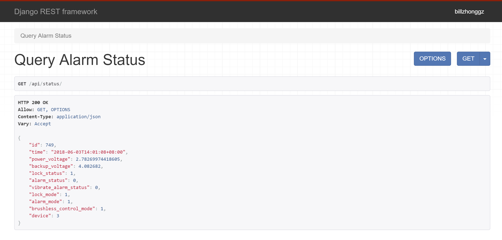
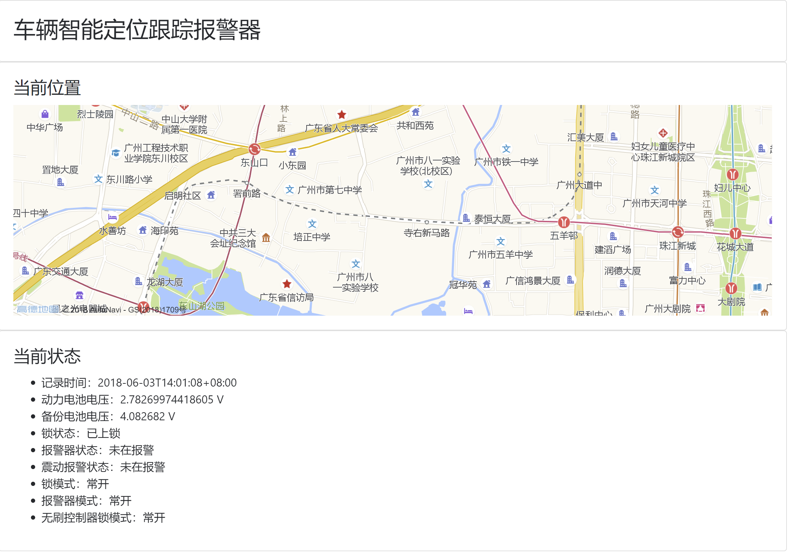

# IoT TCP Server

IoT TCP Server is the server side software of Intelligent Vehicle Locator & Alarm, I can migrate the existing code to adapt this system. The new project applied [Django](https://www.djangoproject.com), a web framework written in Python, [Tornado TCP server](http://www.tornadoweb.org/en/stable/), [Django REST framework](http://www.django-rest-framework.org/), and a de-coupled front-end written in JavaScript and [Vue.js](https://vuejs.org).

## TCP Server

Because the controller in this project is very simple, even HTTP is hard for it, a TCP server is implemented in this project.

The TCP server is implemented by Tornado network library.

In order to bind the TCP server with Django ORM for a simple and safe use of database, the TCP server is isolated (`tcp_standalone.py`) and the Django ORM settings are imported (`SetupDjangoORM.py`).

In Python script `tcp_standalone.py`, it also provides code for decode the message sent by the controller. The decode method vary according to your application.

## Django Back-End

I used Django as the web framework in this project to speed up the development process. `Models.py` is the database structure of this project, it is easy to modify according to your application.

I also applied Django REST Framework as an app in this project to implement a RESTful API for both Android and web front-end. This API implementation locates in `api` folder.

## Web Front-End

I also made a simple web front-end which queries the latest record in the database to achieve so-call "real-time" data. The web front-end directly accesses the RESTful API and display the data in a user-friendly way.

The web front-end is implemented by Vue.js, vue-amap, and bootstrap-vue.

## Usage

You can just easily test or deploy this project in the standard deployment mechanism of any Django application. In my case, I deployed it on my VPS by uwsgi and Nginx.

After you migrate the database, you should run the TCP server first. You can run it by multiple shells, screen or systemd on Linux by `python(3) tcp_standalone.py`. Then you can start Django's develop server by `python(3) manage.py runserver` or directly use the `uwsgi --ini uwsgi.ini` to deploy. Please notice that your server configuration may different from mine.

## License

MIT